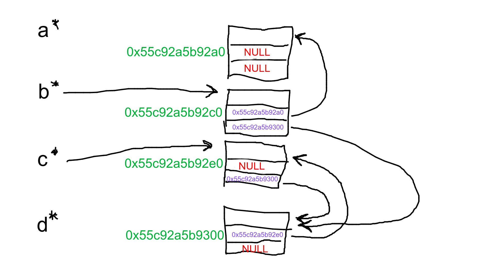
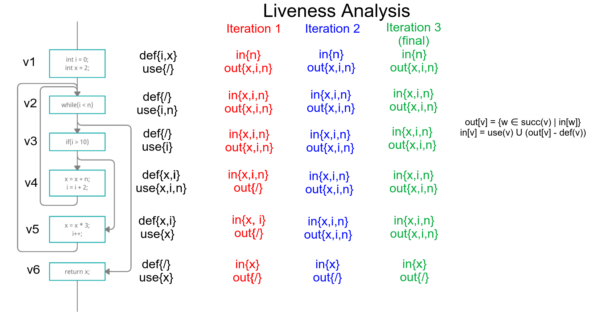
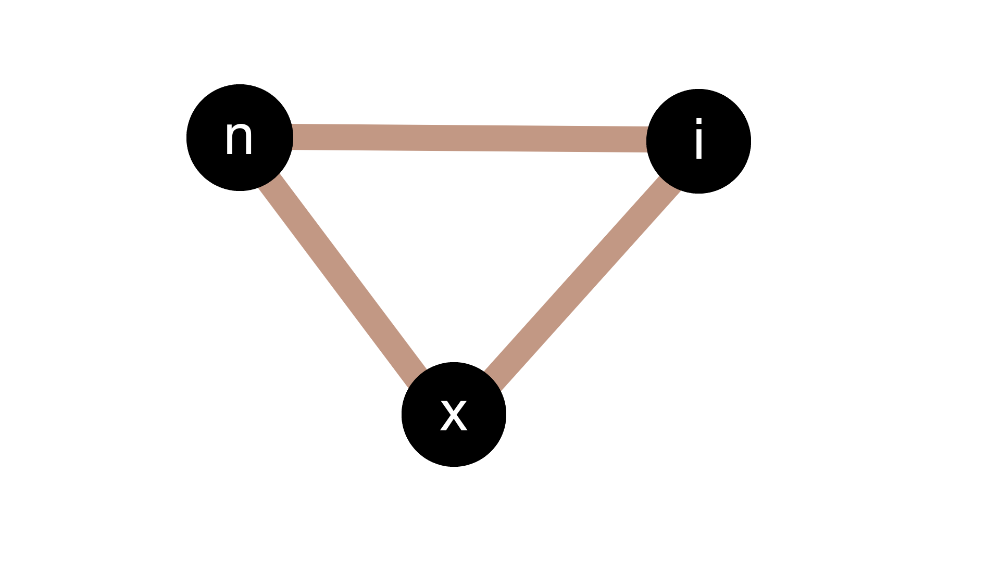
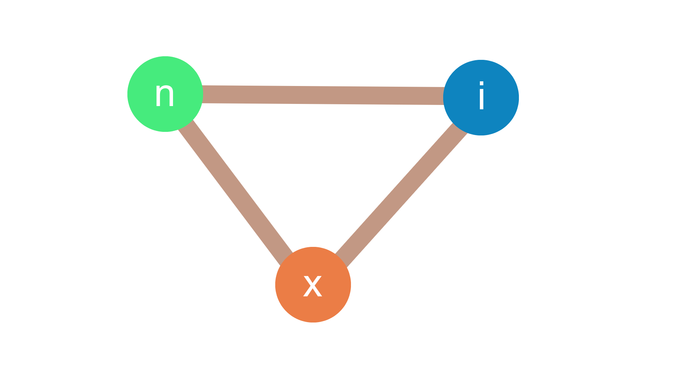

# Theory module 3

## Task 1
### 1a
Command for compiling to objectfile with maximum optimization:

    gcc -c -O3 factorial.c 

Command for compiling to objectfile without optimization:

    gcc -c factorial.c

### 1b
**VAGRANT**

**Optimized:** *827* bytes.

**Unoptimized:** *216* bytes.

### 1c
Data section is *8* bytes.

These 8 bytes are probably the *format* pointer which points to a char array.

### 1d
Bss section is *0* bytes.

The bss section is used for uninitialized data like 
    static int i;
*Factorial.c* doesn't contain any uninitialized data.

### 1e
**fact:**

    cmp    $0x1,%edi
**factorial_message:**

    push    %rbx

### 1f
Command for listing symbols:

    nm a.out 
The first symbol: *_DYNAMIC*

My guess is that the compiler is generating these extra symbols for stack tracing and debugging.

### 1g
Command for removing all symbols:
    
    strip a.out
To confirm that it worked run the following command:

    nm a.out
The result will be *nm: a.out: no symbols*

The symbols are needed when linking or debugging, they exist in executables for debugging and are required in object files for linking.

## Task 2

### 2a

1. Four *S* are created.
1. The pointers in *a* are assigned to NULL.
1. The first pointer in *b* is assigned to *a* and the second one is assigned to *d*.
1. The first pointer in *c* is assigned to NULL and the second one is assigned to *d*.
1. The first pointer in *d* is assigned to *c* and the second one is assigned to NULL.
1. *a* and *d* are set to NULL, leaving their *S* structs directly inaccessiable (but still indirectly accessible).

### 2b
Mark-and-sweep garbage collecting will use the following steps to remove garbage:
1. Use DFS to find all reachable memory blocks and mark them.
    1. Mark the third block (pointed to by *c*).
    1. Mark the fourth block (pointed to by the third block).
1. Iterate through the memory blocks and add the ones not marked (The first and second blocks) to the freelist.

Adding a block to the freelist is simply making the freelist-pointer point to the block and then making that block point to the next free block etc. It is essentially just a linked list of unused memory blocks.

### 2c
Same as above but this time no blocks are reachable which means no blocks are marked and all memory is freed.

### 2d
If reference counting had been used instead, only the first and second blocks would have been freed. This is because in the reference counting method a block is only freed when the number of references to that block is zero but the third and fourth blocks points to each other and will therefore not be freed.

### 2e
A copying garbage collector works by having two separate memory spaces, one which is used by the program and one that is only used for garbage collecting. When the time comes to collect garbage, all reachable memory is copied over from the first block to the other and the blocks switch roles. This is performance costly and requires more initial memory but keeps the used memory compact and causes no fragmentation. 

A Mark-and-sweep garbage collector would insted just free obsolete memory blocks and cause fragmentation but do it faster and with less initial memory.

### 2f
Generational collectors have the benefit of only having to do much work once in a while and therefore it is very performant *almost* all the time, this is probably best used in an application where an occasional lag-spike isn't a big issue but overall performance is important. 

Incremental collectors instead have the benefit of spreading out the work over a longer time and only collecting some garbage at a time. This is probably better in an application where undisturbed running is desired (like a competetive FPS game).

## Task 3
### 3a

### 3b

### 3c
The interference graph is used to get an understanding of which program variables *interfere* with each other in some way, interfere in this case is if they require separete physical registers anywhere in the program. 

The interference graph is then used the same way a map would be used in a graph coloring problem (the problem where two neighbouring countries can't have the same color on a map). A graph coloring heuristic is used to determine a color for each node in the graph, where a color in this example represents a physical register. If there aren't enough physical registers, some node(s) will be marked as potantial spill and later potentially be spilled.

In the case above we have three different program variables which all interfere with each other somewhere, this means that the compiler must assign three physical registers for the program. If instead *n* and *i* didn't interfere, two physical registers would be sufficient (one for *x* and one for *n* **and** *i*).